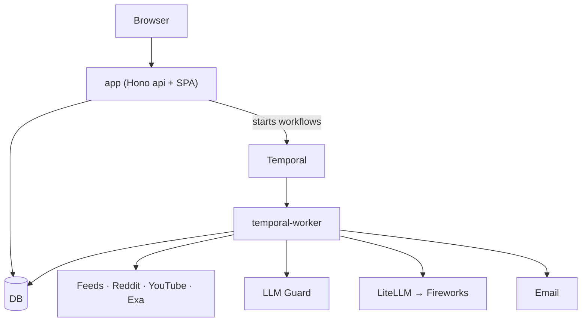
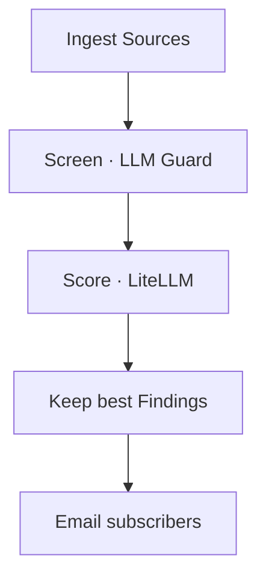
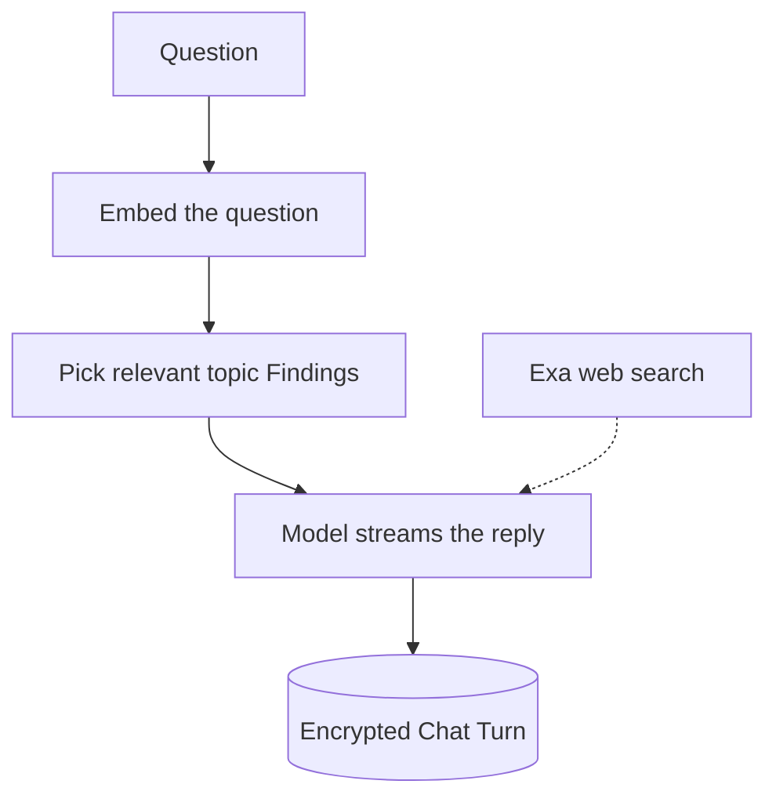
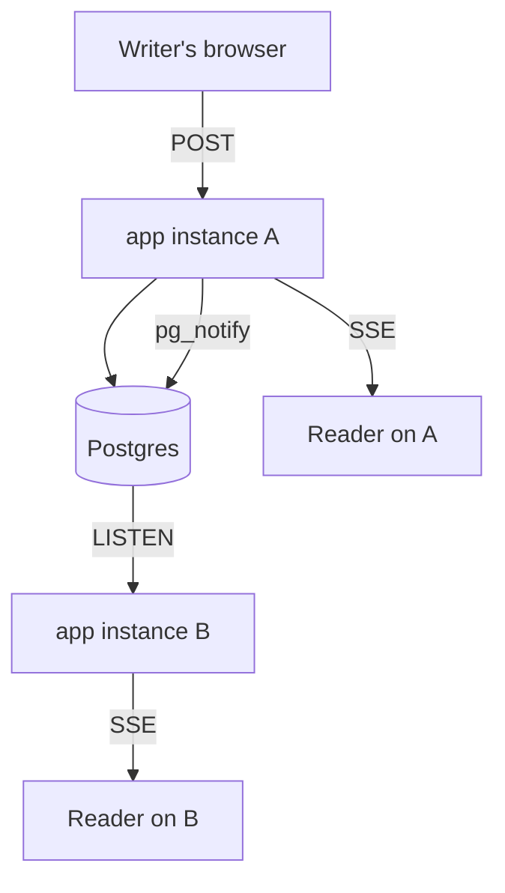

# CarlNotes


**He already read it. All of it.**

Carl doesn't check the news. The news checks in with Carl. Carl never sleeps. He drinks coffee and reads everything. He finished the internet. Now he checks nightly for new stuff. And when you drop by, he has notes.

**Give Carl three topics. You know the ones. He'll brew a hot cup of what you just missed.**

Carl stays up. You stay informed.

<br clear="left" />

[](https://codecov.io/gh/doubleoevan/carlnotes)

## Stack

Bun + TypeScript · React SPA (Vite + Tailwind + shadcn) · TanStack Query · Hono · Better Auth · Drizzle + Neon Postgres (pgvector) · Temporal · LiteLLM → Fireworks · Vercel AI SDK + Zod · Exa + Firecrawl + TwitterAPI.io · Langfuse · LLM Guard · Sentry + PostHog

## Architecture

CarlNotes is a modular monolith with boundaries enforced by TypeScript: one repository, one `package.json`, five modules.

1. `ui/` is a React SPA.
2. `api/` is a Hono server that serves the built SPA and every `/api` route.
3. `worker/` holds the scan pipeline and the Temporal workflows.
4. `db/` holds the Drizzle schema.
5. `shared/` holds the zod contracts, enums, plans, and Source definitions.

That list is the dependency order: each module imports only from the ones below it. `tsconfig` project references make an illegal import a compile error.



Four processes run in production:

| Process | What it does |
|---|---|
| `app` | Serves the SPA and the api. Chat replies and uploads run in-process. |
| `temporal-worker` | One process hosts three Temporal Workers: each Worker polls exactly one task queue, so attachments, topic scans, and source screens each get their own Worker. If any Worker stops, the process exits and the platform restarts it. |
| scheduler | `bun worker/schedule.ts` sweeps for scheduled Topics and starts their scans. Whether a Topic is scheduled is computed from its frequency and Scan window, so a sweep is safe to repeat and there is no stored queue to drift. In production a Northflank cron job runs one sweep per interval (`bun run schedule`). |
| `llm-guard` | The content scanner is its own service (see below). |

Every process above runs on Northflank, which deploys on a git trigger. Managed alongside: Neon Postgres (pgvector), object storage through Bun's S3 client (R2 today; the `S3_*` env values pick the target), a self-hosted Temporal server, Resend, and Stripe. Model calls go through a LiteLLM proxy in front of Fireworks: every user gets a virtual key with a monthly budget, and the [litellm config](litellm-config.yaml) maps role names to models so a model swap is a config edit.

### Scan

A topic Scan is one Temporal workflow:



Each step costs more but handles fewer Resources. Embeddings filter and rank what the Sources found. A cheap model scores what passes. A more expensive model re-scores the best Findings and writes each Finding's relevance explanation. The cheap model then writes the scan report.

Temporal persists every step and retries failed activities. That is why there is no outbox table: the subscriber email is the workflow's last activity, so a crash before it sends resumes there instead of losing it. Emails outside workflows (verification, password reset, reports) send directly through Resend. A failure is reported to Sentry instead of replayed.

### Chat

Every Topic has a chat. It runs in the `app` process, not as a workflow: a reply streams back in seconds, and a lost reply is simply asked again.

Chat is RAG over the Topic's own Feed: the Findings become the context the model writes from. When the Feed cannot answer, the model may call one tool: a live Exa web search, billed per call.



Chat is signed-in only. Every chat turn writes a row, because every chat turn is metered. The model spend is charged to the asker's own LiteLLM key, sharing the same budget a topic scan charges. Chat text is encrypted. A chat that outgrows its context budget is compacted. The newest turns stay whole. Older answers are clipped to their opening characters.

### Live updates

Two components update while you watch them: a team chat room, and a Tasting Note several people are editing. Both push over Server-Sent Events, and neither runs a WebSocket server.

The fan-out between instances is Postgres `LISTEN/NOTIFY`. Each process holds one dedicated listen connection and re-broadcasts to its own subscribers through an in-process `EventEmitter`, so a second instance costs a connection instead of a service. There is no Redis and no socket tier to operate.



A chat room notifies the new message's id and subscribers read the row. A note cannot: a Yjs update is larger than a notify payload, so the instance that merged it delivers the bytes to its own subscribers directly and the notify is only an alert telling the other instances to resync. The note's ydoc stays the source of truth and its `html` column is regenerated on save, so a plain page load never starts the editor.

One deployment detail is load-bearing: `LISTEN` needs the direct Neon connection string, because the pooler never delivers notifications to a listener. `pg_notify` itself goes through the pooler like any other statement. A listen connection that drops reconnects with a backoff from one second to thirty. A note's stream pauses while its tab is hidden.

### Content screening (LLM Guard)

LLM Guard screens untrusted text before any model reads it, protecting the app from prompt injection. A fetched page or an uploaded document may include instructions aimed at the model. LLM Guard runs in Python, so it is its own container: the official `llm-guard-api` image, pinned to one version in `docker-compose.yml` and checked weekly for updates by [a GitHub Action](.github/workflows/llm-guard-update.yml). Locally it is only reachable from your own machine, since it accepts arbitrary text with no auth of its own. In production it is its own Northflank service. The app finds it through one value, `LLM_GUARD_URL`. Unset it and screening turns off while everything else behaves the same.

Two kinds of text are screened, each at its entry point:

- **A document a user hands us** — topic and chat attachments, before context is generated. Detectors: prompt injection, secrets, invisible text, adult content, toxicity.
- **A fetched page** — url Sources, before the page is shown or scored. The same set, minus secrets.

Each screen is one HTTP call with a 2.5-second timeout, and it never blocks the pipeline: on failure the text passes through unflagged. The prompt loader's unconditional untrusted-data fence still applies, and Exa always filters for moderate content.

The scanner also redacts personal details in place, so even a document can come back rewritten. Callers must use the returned text. A detector flags content at a score of 0.8 or above, measured with `bun run eval --guard-only` against articles that merely *discuss* prompt injection, not taken from the vendor default. The update check boots each new release, runs that eval, and files an issue with the measured false-positive and catch rates needed to decide whether to upgrade.

Domain vocabulary is load-bearing and lives in `.agents/skills/domain-model/`.

How the AI guardrails work lives in [docs/ai-scaffolding.md](docs/ai-scaffolding.md).

Feature work lands change-by-change through [OpenSpec](https://github.com/Fission-AI/OpenSpec) — specs and in-flight changes live in `openspec/`.

## Development

```bash
bun install
bun run dev          # api, ui, temporal, and worker together (concurrently, colored per process); run carl-up first for the Docker infra
bun run carl-up      # bring up the Docker infra (litellm proxy, temporal dev server) and create a limited dev key; carl-down stops it
                     # scans run as Temporal workflows, so dev:temporal must be up for any scan to happen, not just for attachments
bun run dev:ui       # Vite dev server (UI); wraps itself in doppler run
bun run dev:api      # Hono API; wraps itself in doppler run for DATABASE_URL; the Vite dev server proxies /api here
bun run dev:worker   # scheduled-scan sweep loop (set SCHEDULE_INTERVAL_MS); `bun run schedule` runs one sweep, as a cron would
bun run dev:temporal # Temporal worker for topic scans and attachment processing; needs a Temporal server (docker-compose `temporal`, or `temporal server start-dev`)
bun run dev:temporal:watch # the same worker, restarted on save; what `bun run dev` uses. a restart mid-review leaves that scan waiting out its 30-minute activity timeout before it fails
bun run dev:email    # react-email preview server for the templates in emails/ (localhost:3011); no doppler needed
bun run dev:docs     # Starlight dev server on localhost:4321/docs, reachable on the LAN, with hot reload; also shows draft pages that the production build leaves out
                     # it runs in the background: `cd docs && astro dev stop` ends it, `astro dev logs` tails it
bun run test:coverage # the test suite with bun's built-in line and function coverage table
bun run smoke:coverage # run every smoke test script, one process each, writing per-file lcov to coverage/smoke; the Smoke workflow runs this on each push to main
                     # with SMOKE_SKIP_LOCAL_SERVICES=1 it skips the six that need litellm or temporal, which is what the workflow sets, since a runner has neither
bun run docs:embed   # chunk the docs markdown by section and embed the changed sections into docs_chunks, which chat quotes; run it after editing docs
bun run docs:embed:prd # the same sync against the production database, the owner-run escape hatch until the deploy job runs it
bun run sync:releases # re-read every published GitHub release into the releases table the /releases endpoint serves; it seeds history and repairs a missed webhook delivery, and is safe to re-run
bun run sync:releases:prd # the same sync against the production database; run it once after the first deploy, since the table starts empty. the webhook writes it going forward
bun run build:ui     # production build (no doppler, so it runs in CI and deploys)
bun run build:docs   # build static docs to docs/dist, which the api serves under /docs
                     # /docs on the api (3000) and through the Vite proxy (5173) is this build, which only changes when you rerun this script and doesn't hot reload
```

The homepage needs both `dev:ui` and `dev:api` running (or just `bun run dev` for the whole stack), plus a seeded dev database (below). The dev, db, and smoke scripts wrap themselves in `doppler run`, so they need a Doppler-configured machine.

Database: generate a migration from the Drizzle schema, then apply it:

```bash
bun run db:generate   # write a migration from db/schema.ts (offline, no doppler)
bun run db:migrate    # apply pending migrations (db/migrate.ts, the same one-shot script the deploy job runs)
bun run db:seed       # creates the dev demo user using a real signup, then loads idempotent stub data (rejects an attempt to run it outside of the dev config)
bun run litellm:restart # reload litellm-config.yaml. the file is bind-mounted, so a restart picks up an edit with no rebuild
```

`db:seed` signs up a real dev account (`DEV_USER_EMAIL` / `DEV_USER_PASSWORD` in `.env.example`) through Better Auth, so log in with those credentials locally to see the seeded demo topics. Auth needs a few more Doppler variables locally: `BETTER_AUTH_SECRET`, `BETTER_AUTH_URL`, `GOOGLE_CLIENT_ID`/`GOOGLE_CLIENT_SECRET`, `GITHUB_CLIENT_ID`/`GITHUB_CLIENT_SECRET`, and `RESEND_API_KEY`/`RESEND_FROM_EMAIL` — see `.env.example` for what each is for. Signup itself is open: no invite code, Google/GitHub are one-click, and email/password sits behind a "Continue with email" toggle.

Backfills (owner-run) — one-time data migrations that pair with a schema change. Idempotent, so a second run is a no-op, and run under `doppler` against the configured database:

```bash
doppler run -- bun scripts/backfill-resource-content.ts   # upload existing resources.content to object storage, set content_key/content_bytes
```

The content scanner (LLM Guard, see Architecture above) is optional too: `bun run llm-guard:up` and set `LLM_GUARD_URL`. Error monitoring and product analytics are the same: when `SENTRY_DSN` and `POSTHOG_API_KEY` are not set, the monitoring and analytics are off but the app behaves the same.

Billing (Stripe) is optional locally: subscriptions map to the free/plus/premium plans and a Stripe webhook derives the active plan. It needs `STRIPE_SECRET_KEY`, `STRIPE_WEBHOOK_SECRET`, the per-plan `STRIPE_PRICE_*` ids, and a metered `STRIPE_PRICE_MANUAL_SCAN_OVERAGE` (see `.env.example`). Until they're set, checkout, the Customer Portal, metered overage, and the admin console's Stripe net-revenue line are static. The gate, plans, and quotas all work without Stripe.

Checks — run the full gate with one command (enforced on push by `scripts/preflight.sh`):

```bash
bun run check       # biome + tsc + workflow bundles + bun test
```

Or run them individually:

```bash
bunx biome check .
bunx tsc -b
bun test
bun run check:workflows # every Temporal workflow file still bundles
```

Live smoke tests (owner-run) — exercise real flows against live services (LiteLLM proxy, Firecrawl, object storage), so they make paid calls and are **not** part of `bun run check`. Need the LiteLLM proxy up (`docker compose up -d litellm`) and the latest migration applied; the attachment smoke test also needs a Temporal server (`docker compose up -d temporal`) and the running worker (`bun run dev:temporal`):

```bash
bun run smoke              # run all smoke tests
bun run smoke:scan         # just the topic-scan smoke test (ingestion + review, end-to-end)
bun run smoke:store        # just the resource-content object-storage round-trip (put → read → delete)
bun run smoke:attach       # just the URL-attachment smoke test (Firecrawl → store → Temporal workflow → ready)
bun run smoke:search       # just the web search smoke test (context → LLM queries → Exa → Resources)
bun run smoke:reddit       # just the reddit access smoke test: a subreddit and a search Source through each mode, reporting which one answered
bun run smoke:x            # just the X smoke test: one account's tweets and what they cost, plus the lookup that vets a suggested account
bun run smoke:review       # just the review smoke test: the paid section buys its best survivors, bounded by its limit
bun run smoke:subscribers  # just the subscriber-count smoke test: both subscription paths against real rows, rolled back after
bun run smoke:profile      # just the profile smoke test: the header's distinct people against the footer's summed rows
bun run smoke:chat         # just the topic chat retrieval smoke test (question → ranked findings → assembled context)
bun run smoke:eval         # just the eval-harness smoke test: one tiny labeled fixture through the real gate and scoring
bun run smoke:teams        # just the team-lifecycle smoke test: creation, join fan-out, limits, last-leader, deletion, and detach succession
bun run smoke:room         # just the team chat-room smoke test: the access matrix, isolation, budget rejection, mention rows, and the room lock
bun run smoke:rooms        # just the chat-rooms smoke test: which rooms a viewer may open, one per holding team, and the unseen count
bun run smoke:invites      # just the invite smoke test: link authority and races, resolution, who-may-invite, connections, and accept-equals-redeem
```

Run the reddit smoke test from the deployed environment, not just a laptop: 
Reddit's keyless endpoints serve a home internet connection but often return 403 to a hosting provider's IP range, 
so the same test can pass on your machine and fail in production.

The review smoke test reads `REVIEW_CONCURRENCY` and `MAX_SCORED_RESOURCES_PER_SCAN`, so it doubles as an A/B for the concurrency limit. Each run resets its feed's Resources cold first, so two runs differ only by their settings:

```bash
REVIEW_CONCURRENCY=1 MAX_SCORED_RESOURCES_PER_SCAN=8 bun run smoke:review
```

Evals (owner-run) measure the review pipeline against a labeled corpus. They run the real embed-filter and tiered scoring, so they spend money and are **not** part of `bun run check`. Fixtures and the labeling workflow live in [evals/README.md](evals/README.md):

```bash
bun run eval                      # measure every fixture: precision, recall, cost per topic, and scanner false positives
bun run eval --export <topicId>   # write an unlabeled fixture from a real Topic's Resources, ready to label
bun run eval --guard-only         # only LLM Guard's false-positive and attack-catch rates; no model spend
```

A weekly GitHub Action (`.github/workflows/llm-guard-update.yml`) watches Docker Hub for new LLM Guard releases, boots the candidate on the runner, runs the guard-only eval against it, and files an issue with both measured rates, so a scanner upgrade arrives as a pre-measured decision, never an unchecked version bump. Read the two rates together: a scanner that flags nothing scores a perfect false-positive rate, and one that flags everything scores a perfect catch rate.

Prompt registry (owner-run): git is the source of truth for prompt wording (`worker/prompts/*.md`); this pushes it up to Langfuse as the `production` version each prompt is served from. Idempotent: an unchanged prompt creates no new version. Needs `LANGFUSE_PUBLIC_KEY`/`LANGFUSE_SECRET_KEY` set. `--candidate` uploads under the `candidate` label instead, leaving the served `production` label untouched until someone promotes the version in Langfuse by hand — the deploy job runs that form, while these two scripts write `production` directly.

Each Doppler config points at its own Langfuse project, so the environment is chosen at the `doppler run` call and there is one script per target. The script names the environment it wrote to in its summary line, since a run against dev otherwise reads exactly like a run against production:

```bash
bun run prompts:sync
```

```bash
bun run prompts:sync:prd
```

Container image: The app service is the Hono API plus the built UI bundle it serves. It builds from the repo-root `Dockerfile` and starts under `doppler run`. The LiteLLM proxy is a separate service with its own image in `infra/litellm/`:

```bash
docker build --platform=linux/amd64 --build-arg VITE_TURNSTILE_SITE_KEY=<site-key> -t carlnotes-app .
```

`VITE_TURNSTILE_SITE_KEY` is the one setting that cannot wait for `doppler run`: Vite inlines it into the bundle at build time, so it has to be present during the build. It is a public key that ships to every visitor.

`--platform=linux/amd64` matters on Apple Silicon. The Doppler CLI is copied from `dopplerhq/cli:3`, which publishes amd64 only.

Migrations are a deploy job, not a start-up step. A push to `main` runs the `release-main` pipeline, which builds the image once, runs this job against it, and only then deploys `app` and `temporal-worker`, finishing with the docs embed. It runs in Northflank instead of GitHub Actions, and its definition is [infra/northflank/release-main.json](infra/northflank/release-main.json). `.github/workflows/` holds the offline gate alone. So new code never meets an old schema:

```bash
doppler run -- bun db/migrate.ts
# or
bun run db:migrate
```

Prompts are a deploy job too, uploaded as candidates instead of promoted. Without this the registry keeps serving the wording it already had while the repo moves on, and a scan reads stale prompts:

```bash
doppler run -- bun worker/prompts/sync.ts --candidate
# or
bun run prompts:sync --candidate
```

The docs embeddings are a deploy job too. It re-embeds only the sections whose words changed, so a push that leaves the docs alone costs nothing:

```bash
doppler run -- bun worker/docsSync.ts
# or
bun run docs:embed
```

Promote a candidate to production in Langfuse once a real scan's note reads right. The runtime falls back to the bundled template whenever a registry template asks for variables the code does not fill, so a stale label can never break a prompt. A prompt whose live wording differs from the bundled one is logged once per process.

The temporal worker and the scan sweep are their own services, built from this same image with the command overridden. They pick up new code on every deploy exactly as the api does. `schedule` decides what to scan and `temporal` does the scan work.

```bash
doppler run -- bun worker/temporal.ts
# or
bun run dev:temporal
```

```bash
doppler run -- bun worker/schedule.ts
# or
bun run schedule
```

Without the `temporal` worker, `workflow.start` still succeeds against a queue nobody polls: scans queue silently and the api looks healthy. The scan sweep reports when no worker is polling the scan queue, which is the check to alert on.

## Attribution

The persona for CarlNotes was inspired by [Jake Van Clief](https://www.linkedin.com/in/jake-van-clief-74b66915a/). The real Jake runs [Eduba](https://eduba.io), an AI training and consulting company, makes excellent videos on [YouTube](https://www.youtube.com/@JEVanClief), and teaches AI systems over at [Clief Notes](https://www.skool.com/cliefnotes). Go learn from him. Carl would.

## License

AGPL-3.0-only
