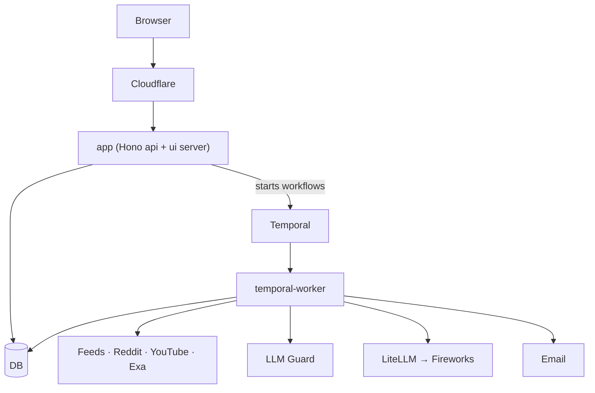
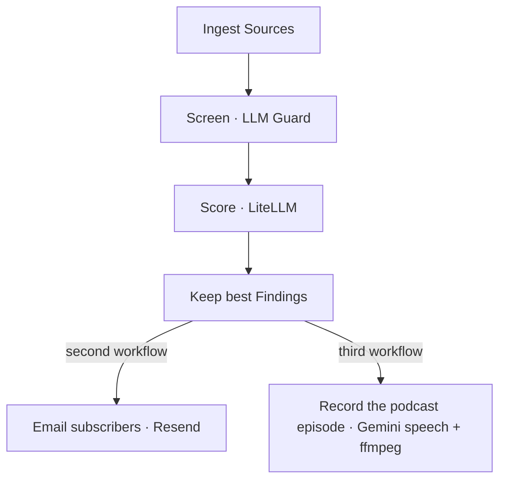
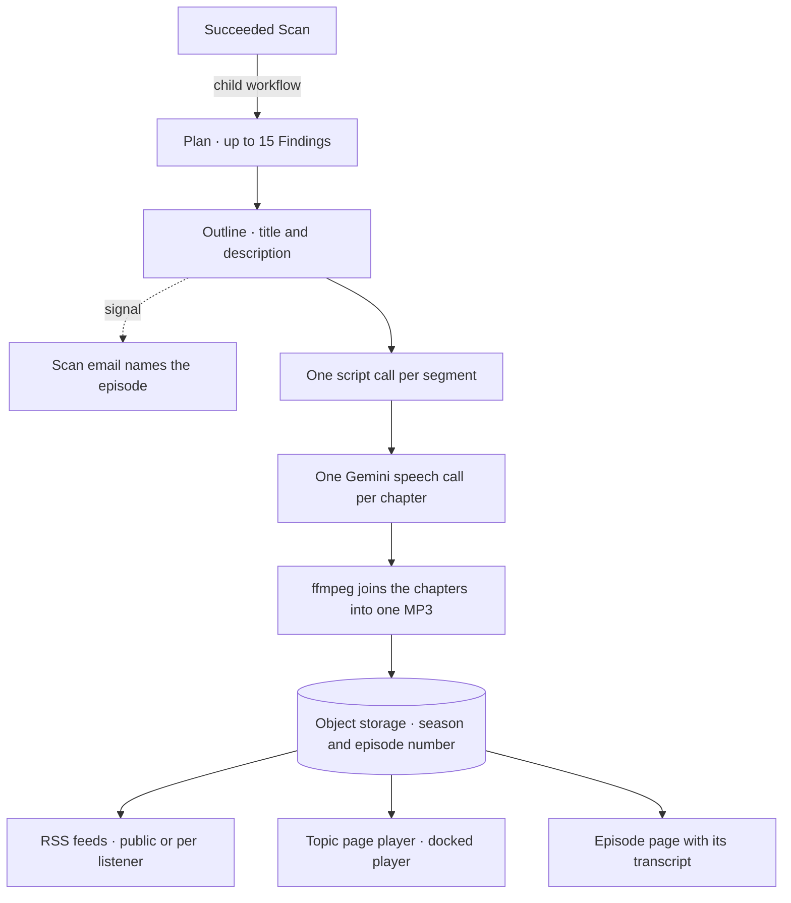
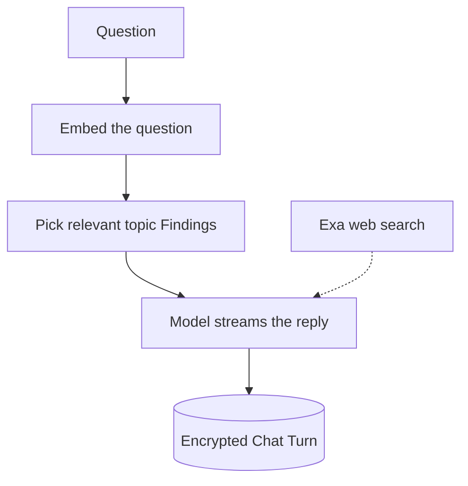
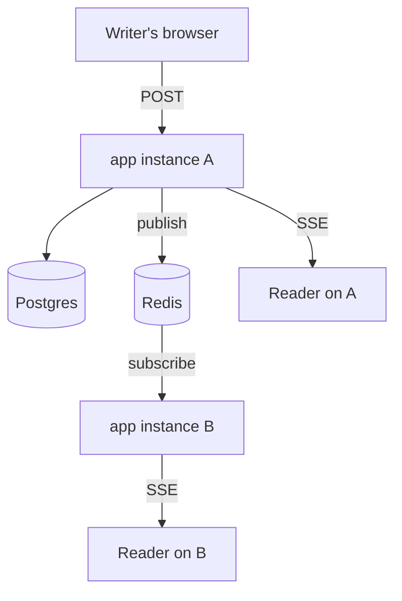
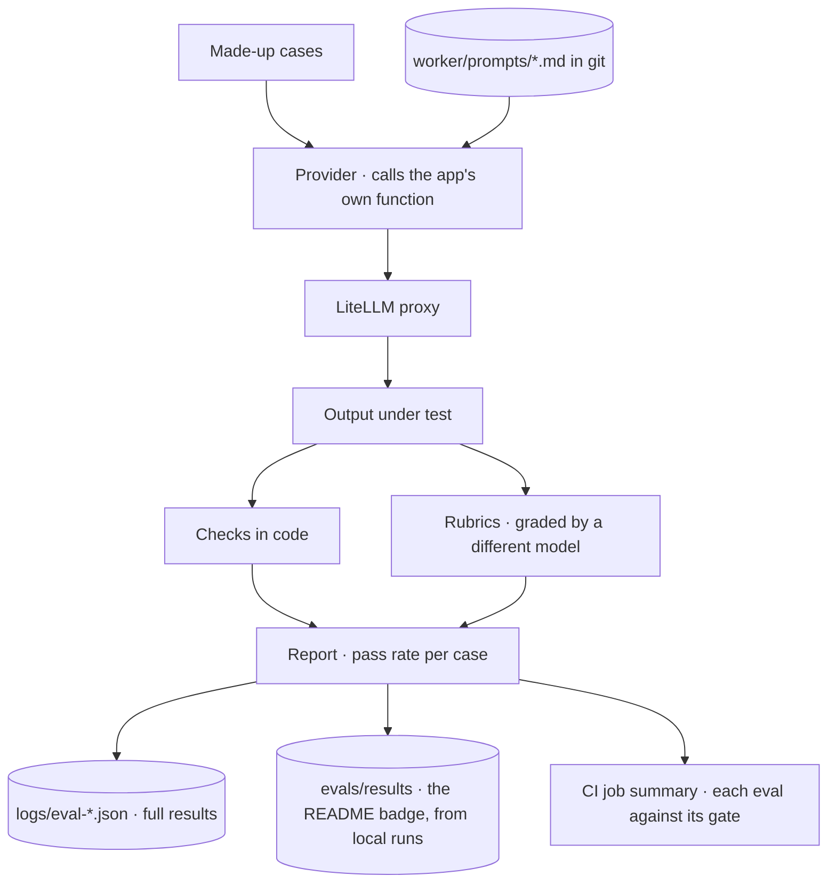

# CarlNotes


**He already read it. All of it.**

Carl doesn't check the news. The news checks in with Carl. Carl never sleeps. He drinks coffee and reads everything. He
finished the internet. Now he checks nightly for new stuff. And when you drop by, he has notes and a podcast.

**Give Carl three topics. You know the ones. He'll brew a hot cup of what you just missed.**

Carl stays up. You stay informed.

<br clear="left" />

[](https://codecov.io/gh/doubleoevan/carlnotes)
[](evals/README.md)

## Stack

Bun + TypeScript · React (TanStack Start + Vite + Tailwind + shadcn) · TanStack Query · Hono · Better Auth · Drizzle +
Neon Postgres (pgvector) · Temporal · LiteLLM → Fireworks + Gemini speech · Vercel AI SDK + Zod · Exa + Firecrawl +
TwitterAPI.io · Langfuse · LLM Guard · Sentry + PostHog

## Architecture

CarlNotes is a modular monolith: one repository, one `package.json`, five modules.

1. `ui/` is a TanStack Start React app. Its public pages render on the server for a visitor, and every page renders in
   the browser for a signed-in user.
2. `api/` is a Hono server that serves every `/api` route, the `/mcp` server and its oauth discovery documents, the
   document routes (the sitemap, the feeds, the llms files, the IndexNow key, and security.txt), the blog and release
   pages, and the built docs, and renders every other page through the ui's server build.
3. `worker/` holds the scan pipeline and the Temporal workflows.
4. `db/` holds the Drizzle schema.
5. `shared/` holds the zod contracts, enums, plans, and Source definitions.

That list is the dependency order: each module imports only from the ones below it. `scripts/check-ui-boundary.ts` fails
the preflight when the ui imports the api, the worker, or the db folder as a value.


```mermaid
flowchart
    Browser --> Edge[Cloudflare] --> App["app (Hono api + ui server)"]
    App --> Postgres[(DB)]
    App -->|starts workflows| Temporal
    Temporal --> Worker[temporal-worker]
    Worker --> Sources[Feeds · Reddit · YouTube · Exa]
    Worker --> Guard[LLM Guard]
    Worker --> LiteLLM[LiteLLM → Fireworks]
    Worker --> Postgres
    Worker --> Resend[Email]
```

These processes run in production:

| Process | What it does |
|---|---|
| `app` | Serves the api and the ui, rendering public pages on the server. Chat replies and uploads run in-process. |
| `temporal-worker` | One process hosts five Temporal Workers: each Worker polls exactly one task queue, so attachments, topic scans, scan emails, podcast episode recordings, and source screens each get their own Worker. If any Worker stops, the process exits and the platform restarts it. |
| scheduler | `bun worker/schedule.ts` sweeps for scheduled Topics and starts their scans. Whether a Topic is scheduled is computed in one query from its frequency and Scan window, so a sweep is safe to repeat and there is no stored queue to drift. A database claim keeps two sweeps from overlapping. In production a Northflank cron job runs one sweep per interval (`bun run schedule`). |
| budget reset | `bun worker/resetMonthlyBudgets.ts` replaces every LiteLLM key created before the month began, so each user's spend starts the month at zero. The reset replaces a few keys at a time, under the same kind of database claim as the sweep. In production a Northflank cron job runs the reset once a day shortly after midnight UTC (`bun run reset:monthly-budgets`). After the first of the month, the reset finds only the keys that an earlier run failed to replace. |
| `llm-guard` | The content scanner is its own service (see below). |

Every process above runs on Northflank, which deploys on a git trigger. `app` and `temporal-worker` each run as
replicas. The state that every `app` replica shares lives in Redis. Temporal gives each scan to one worker. Managed
alongside: Neon Postgres (pgvector), a single-node Redis addon reached as `REDIS_URL`, object storage through Bun's S3
client (R2 today, picked by the `S3_*` env values), a self-hosted Temporal server, Resend, and Stripe. Model calls go
through a LiteLLM proxy in front of Fireworks: every user gets a virtual key with a monthly budget, and the [litellm
config](litellm-config.yaml) maps role names to models so a model swap is a config edit.

### Scan

A topic Scan is one Temporal workflow, its email is a second one, and its podcast episode is a third:


```mermaid
flowchart
    Ingest[Ingest Sources] --> Screen[Screen · LLM Guard] --> Score[Score · LiteLLM] --> Review[Keep best Findings] -->|second workflow| Email[Email subscribers · Resend]
    Review -->|third workflow| Episode[Record the podcast episode · Gemini speech + ffmpeg]
```

Each step costs more but handles fewer Resources. Embeddings filter and rank what the Sources found. A cheap model
scores what passes. A more expensive model re-scores the best Findings and writes each Finding's relevance explanation.
The cheap model then writes the scan report.

Temporal persists every step and retries failed activities. That is why there is no outbox table: once a Scan is
complete, its workflow starts the email workflow on the `scan-emails` queue, which runs one activity per Resend call. A
rate limit waits for Resend's `retry-after`, a 5xx backs off, and a send that fails for good is reported to Sentry
without failing the Scan. Each accepted batch records its sends with the Scan, so a retry never mails anyone twice.
Emails outside workflows (verification, password reset, invites, flag notices) send directly through Resend, and a
failure is reported to Sentry instead of replayed. Every call to Resend, from the app or the worker, first takes a rate
limit slot held in Redis, which one call holds for 200 milliseconds. Calls leave evenly spaced at five a second, half of
Resend's ten.

A succeeded Scan also starts the podcast episode workflow, described under Podcast below.

### Podcast

Every Topic has a podcast with two AI hosts, Carl and Vienna. A succeeded Scan starts its episode as a child workflow on
the `episode-recordings` queue, and an episode never holds up the Topic's next Scan.


```mermaid
flowchart
    Scan[Succeeded Scan] -->|child workflow| Plan[Plan · up to 15 Findings]
    Plan --> Outline[Outline · title and description]
    Outline -.->|signal| Email[Scan email names the episode]
    Outline --> Segments[One script call per segment]
    Segments --> Speech[One Gemini speech call per chapter]
    Speech --> Encode[ffmpeg joins the chapters into one MP3]
    Encode --> Publish[(Object storage · season and episode number)]
    Publish --> Feeds[RSS feeds · public or per listener]
    Publish --> Player[Topic page player · docked player]
    Publish --> Page[Episode page with its transcript]
```

The plan picks up to fifteen Findings by score from the Scan's new ones and the ones a user liked or bookmarked or whose
page is one of the Topic's url Sources. A like, a bookmark, and a url Source's page each add a score bonus of 0.2. A new
Finding wins a tie, and the Scan's new ones are narrated first. Any slots left go to the Topic's best that no episode
has covered, then to ones that earlier episodes covered. A Finding rated thumbs down is never narrated. The outline call
saves the episode's title and description and signals the Scan's email workflow, which waits for that signal so the
email can name the episode. One script call per segment writes the two hosts' turns against the outline, in up to three
drafts: a draft that fails a check is retried with the reason, and a third draft is repaired instead of failing the
episode. The sign-off ends on two fixed lines and then a goodbye that the writer words differently every time. The
prompts are in `worker/prompts/`.

Each chapter is recorded as one two-speaker Gemini speech call through LiteLLM's pass-through. A manual Scan's
chapters are recorded on the standard tier, and a scheduled Scan's on Gemini's Flex tier, where a chapter may wait up to
six hours for capacity. A chapter whose speech fails for good is left out, and the episode publishes the rest. ffmpeg
joins the chapters into one MP3 in object storage, and the publish gives the episode its season, the UTC year, and its
number within that season.

An episode reaches listeners three ways. A public Topic has a public RSS feed at `/topics/:id/podcast.xml`, a private or
invite Topic gives each listener their own feed at `/podcast-feeds/:token.xml`, and each is cached in Redis while it
lists up to 100 episodes. The topic page has the player, a docked player follows the listener from page to page, and
when an episode ends, the next unplayed episode from the listener's other Topics starts. Each published episode has its
own page with its transcript, rendered on the server for a public Topic. Every episode page has its preview card, so a
shared link previews no matter what the Topic's visibility is, and a private or invite Topic's episode page is noindex
and shows the Topic's gate to anyone who may not see the Topic. Covers are drawn over
`docs/design/podcast/cover-base.png`.

`PODCAST_SPEECH_MODEL` set empty turns episodes off, and `PODCAST_RECORDING_CONCURRENCY` (16 by default) limits the episode
activities on each worker replica. A free Topic gets a 10-minute episode after every brew and keeps only the latest
short one, where a paid plan gets 30 minutes and keeps every episode. A brew that finishes while the free Topic's short
episode is still recording makes no episode, and its findings go into the next one. Episodes pause once a user's monthly
spend passes the plan's share of the budget, half on the free plan and 80 percent on a paid one, so scans keep running.

### Chat

Every Topic has a chat. It runs in the `app` process, not as a workflow: a reply streams back in seconds, and a lost
reply is simply asked again.

Chat is RAG over the Topic's own Feed: the Findings become the context the model writes from. When the Feed cannot
answer, the model may call one tool: a live Exa web search, billed per call.


```mermaid
flowchart
    Question --> Embed[Embed the question] --> Retrieve[Pick relevant topic Findings] --> Reply[Model streams the reply] --> Store[(Encrypted Chat Turn)]
    Search[Exa web search] -.-> Reply
```

Chat is signed-in only. Every chat turn writes a row, because every chat turn is metered. The model spend is charged to
the asker's own LiteLLM key, sharing the same budget a topic scan charges. Chat text is encrypted. A chat that outgrows
its context budget is compacted. The newest turns stay whole. Older answers are clipped to their opening characters.

### Live updates

Two components update while you watch them: a team chat room, and a Tasting Note several people are editing. Both push
over Server-Sent Events, and neither runs a WebSocket server.

The fan-out between instances is Redis pub/sub. The instance that stored a change delivers the change to its own
subscribers through an in-process `EventEmitter` first and then publishes the change. Every other instance re-broadcasts
what it receives to its own subscribers. The instance that published skips its own echo. The same Redis holds the
sessions, the caches for the mention count and the topic page's scan poll, the shared limiters, and the Resend limit
that the worker shares too, so more than one `app` replica can run at once. Every database connection goes through
Neon's connection pooler. There is no socket tier to operate.


```mermaid
flowchart
    Writer[Writer's browser] -->|POST| App1["app instance A"]
    App1 --> Postgres[(Postgres)]
    App1 -->|publish| Redis[(Redis)]
    Redis -->|subscribe| App2["app instance B"]
    App1 -->|SSE| ReaderA[Reader on A]
    App2 -->|SSE| ReaderB[Reader on B]
```

A chat room publishes the new chat message's id and any topic tool calls from that chat turn, and subscribers read the
row. A note publishes a poke. A Yjs update can be far larger than any message worth publishing, so the instance that
merged the update delivers the bytes to its own subscribers directly and the poke tells the other instances to resync.
The note's ydoc stays the source of truth and its `html` column is regenerated on save, so a plain page load never
starts the editor.

Nothing published while a subscriber was disconnected is replayed. A chat stream catches up from its cursor on the next
chat message. A note resyncs on the next poke, or when its stream closes at the fifteen-minute age limit. A Redis
connection that drops reconnects with a backoff from one second to thirty. While Redis is unreachable, a session is read
from Postgres, each cache calls its loader, each limit allows the request, and the storing instance still delivers to
its own subscribers. A note's stream pauses while its tab is hidden.

### Content screening (LLM Guard)

LLM Guard screens untrusted text before any model reads it, protecting the app from prompt injection. A fetched page or
an uploaded document may include instructions aimed at the model. LLM Guard runs in Python, so it is its own container:
the official `llm-guard-api` image, pinned to one version in `docker-compose.yml` and checked weekly for updates by [a
GitHub Action](.github/workflows/llm-guard-update.yml). Locally it is only reachable from your own machine, since it
accepts arbitrary text with no auth of its own. In production it is its own Northflank service. The app finds it through
one value, `LLM_GUARD_URL`. Unset it and screening turns off while everything else behaves the same.

Two kinds of text are screened, each at its entry point:

- **A document that a user gives us** — topic and chat attachments, before context is generated. Detectors: prompt
  injection, secrets, invisible text, adult content, toxicity.
- **A fetched page** — url Sources, before the page is shown or scored. The same set, minus secrets.

Each screen is one HTTP call with a 2.5-second timeout, and it never blocks the pipeline: on failure the text passes
through unflagged. The prompt loader's unconditional untrusted-data fence still applies, and Exa always filters for
moderate content.

The scanner also redacts personal details in place, so even a document can come back rewritten. Callers must use the
returned text. A detector flags content at a score of 0.8 or above. Measured with `bun run eval:review-pipeline --guard-only`
on 2026-10-05, that threshold flags 4 of 10 articles that merely *discuss* prompt injection and catches 15
of 16 known attacks. A long article can also take a CPU scanner past the 2.5-second timeout, where the screen fails
open. The false positives and the timeouts need fixing before the scanner screens production pages. The update check
boots each new release, runs that eval, and files an issue with the measured false-positive and catch rates needed to
decide whether to upgrade.

### Caching at the edge

Cloudflare sits in front of carlnotes.com and serves what it can cache, so the one `app` process renders only what
changes from person to person.

- A page rendered for a signed-out visitor, a blog or release page, and the signed-out feed look the same to every
  visitor. Cloudflare caches each for a minute, then serves that copy for up to another minute while it fetches a fresh
  one. The browser still asks Cloudflare on every load. A request with a session cookie always goes to the app, since
  the same url shows a signed-in user something else.
- An avatar or a link-preview card names its version in its url, so the browser caches it for a year and Cloudflare for
  a day, and a new image gets a new url. Hashed assets are cached for a year.
- Cloudflare compresses every text response on the way out, so the app sends them uncompressed.

Every request reaches the app from a Cloudflare address, so `TRUSTED_PROXIES` lists Cloudflare's published ranges, and
the client is the rightmost `x-forwarded-for` address outside them. Better Auth and the rate limiter read it with the
same settings. None of Cloudflare's own settings live in this repo. The cache rules, the session cookie bypass, SSL, and
the rule that lets Northflank renew its certificate are listed in the `cache-at-the-edge` change's design, under
`openspec/changes/archive/`.

Domain vocabulary is load-bearing and lives in `.agents/skills/domain-model/`.

How the AI guardrails work lives in [docs/ai-scaffolding.md](docs/ai-scaffolding.md).

Feature work lands change-by-change through [OpenSpec](https://github.com/Fission-AI/OpenSpec) — specs and in-flight
changes live in `openspec/`.

## Evals

An eval measures what a model-facing prompt writes, an output that has no one exact value for a test to check. Each
promptfoo eval runs made-up cases through the same function that the app calls, with the prompt templates in git, and
grades every output: in code where it can, such as links, lengths, ids, and the tools a chat turn called, and by a
second model against a written rubric where it takes judgment. A model's output varies from run to run, so an eval
reports how often each case passes. The evals make real model calls, so they never run in `bun run check`. The Evals
workflow runs the promptfoo evals in CI, report-only.


```mermaid
flowchart
    Cases[Made-up cases] --> Provider[Provider · calls the app's own function]
    Templates[(worker/prompts/*.md in git)] --> Provider
    Provider --> LiteLLM[LiteLLM proxy]
    LiteLLM --> Output[Output under test]
    Output --> Code[Checks in code]
    Output --> Rubrics[Rubrics · graded by a different model]
    Code --> Report[Report · pass rate per case]
    Rubrics --> Report
    Report --> Results[(logs/eval-*.json · full results)]
    Report --> Badge[(evals/results · the README badge, from local runs)]
    Report --> Summary[CI job summary · each eval against its gate]
```

| Eval | What it measures | Command |
|---|---|---|
| Grader calibration | Every eval's rubric graders: an output that keeps a rubric passes, and one that breaks it fails | `bun run eval:grader-calibration` |
| Review pipeline | Precision, recall, and cost of the relevance gate and the scoring prompt over hand-labeled fixtures, plus LLM Guard's false-positive and catch rates | `bun run eval:review-pipeline` |
| Podcast episode script | The outline and segment prompts: chapters cite real Findings, every claim is supported, quotes are short and named, the title and description fit, three Findings or fewer make one segment and four or more make two to four, with a transition into each one after the first, and the goodbye is left to the show | `bun run eval:podcast-episode-script` |
| Scan report | Carl's note on every scan: links every kept finding and nothing else, says nothing the scan data lacks, names a failed source, stays short | `bun run eval:scan-report` |
| Topic chat | The topic chat: opens by answering the question, credits the findings only with what they say, marks what comes from outside them, answers a question about the app from the docs, links only real finding and docs urls, stays brief | `bun run eval:topic-chat` |
| Team chat | The chat on a team's page, across the team's topics: names the right topic for each finding, credits the findings only with what they say, links only real finding and docs urls | `bun run eval:team-chat` |
| Topic chat tools | The topic chat's edit tools, in the solo chat and the team room: a change of settings, sources, or prompt is proposed before it is saved, a yes saves it, a decline takes the preview back, a question or an instruction inside a finding calls nothing, and no reply claims an action that no tool made | `bun run eval:topic-chat-tools` |
| New-topic chat | The chat that makes a topic: writes what the user says to the draft, its visibility included, creates the topic only after a yes, never calls a change saved that no tool saved | `bun run eval:new-topic-chat` |
| Source suggestions | The suggested Sources, end to end through Exa and the readability checks: the share of new suggestions that resolve and read, enough readable sources, every one on topic and still publishing | `bun run eval:source-suggestions` |
| Search queries | The queries that a Scan writes for a topic: within the limit, distinct, plain text, on topic, and respecting what the topic skips | `bun run eval:search-queries` |
| Attachment summaries | The summary of an attached document and the description of an attached image: nothing the attachment does not show, the facts a user needs, and a long document summarized from the part before its cut | `bun run eval:attachment-summaries` |

The review pipeline's baseline, from two public topics' fixtures on 2026-10-05: 68% precision and 83% recall for Dev
Tools for Builders, 93% and 100% for AI Coding Tools, and $0.10 a fixture. LLM Guard 0.3.16 caught 15 of 16 known
attacks and flagged 4 of 10 articles that only discuss injection. The fixtures, their labels, and what the numbers can
and cannot say are in [evals/README.md](evals/README.md).

Every eval whose prompt reads outside material that a case can hold also has a case with an instruction planted in that
material, which the output must not follow. The source suggester reads live search results, which a case cannot hold.
Every promptfoo eval shares `evals/evalHarness.ts`, which runs the cases, grades the rubrics on a model other than the
one under test, prints the report with the eval's pass rate and its 95% interval, and saves the full results. Each eval
names its gate, the pass rate that it has to clear. A local run saves its pass count, its commit, and its models to
`evals/results/`, which the evals badge at the top of this README reads, so commit `evals/results/` after the runs it
should show. The grader calibration eval checks the graders themselves, so run it first when a grader model changes. Run
an eval before shipping a change to its prompt or its model, with `--repeat 3` to see how often each case passes. Each
eval costs cents to a dollar a run, and the review pipeline's cost depends on its fixtures.

```bash
bun run eval:scan-report --repeat 3                 # run each case three times and print a pass rate per case
bun run eval:review-pipeline --with-examples        # score with the topic's rated and bookmarked pages as examples
bun run eval:review-pipeline --guard-only           # only LLM Guard's false-positive and catch rates, with no model spend
```

A review pipeline fixture is exported from the database that holds a public topic's ratings, read-only, and its page
text goes to a gitignored page cache:

```bash
doppler run --config prd -- bun evals/review-pipeline/reviewPipelineEval.ts --export <topicId>
```

A weekly GitHub Action (`.github/workflows/llm-guard-update.yml`) watches Docker Hub for new LLM Guard releases, boots
the candidate on the runner, runs the guard-only eval against it, and files an issue with the measured false-positive
and catch rates, so a scanner upgrade arrives as a pre-measured decision, never an unchecked version bump. Read the two
rates together: a scanner that flags nothing scores a perfect false-positive rate, and one that flags everything scores
a perfect catch rate.

The Evals workflow (`.github/workflows/evals.yml`) runs every promptfoo eval one at a time against a LiteLLM container,
each case once on a push and three times weekly or by hand. It only reports. An eval below its gate is a warning, the
build still passes, and a run in CI saves no result. The job summary lists each eval's pass rate, interval, and gate,
and the full results are an artifact of the run. The full review pipeline eval runs only locally, where its gitignored
page cache lives.

How each eval works, how to read its report, and how to write a new one live in [evals/README.md](evals/README.md).

## Development

```bash
bun install
bun run dev          # api, ui, temporal, and worker together (concurrently, colored per process); run carl-up first for the Docker infra
                     # `mkdir -p logs && bun run dev 2>&1 | tee logs/dev.log` keeps a copy to tail from another shell; logs/ is gitignored
                     # every line is prefixed with its process, so `grep '^\[api\]' logs/dev.log` reads one of them
bun run carl-up      # bring up the Docker infra (litellm proxy, temporal dev server, Redis) and create a limited dev key; carl-down stops it
                     # scans run as Temporal workflows, so dev:temporal must be up for any scan to happen, not just for attachments
bun run dev:ui       # Vite dev server (UI); wraps itself in doppler run
bun run dev:api      # Hono API; wraps itself in doppler run for DATABASE_URL; the Vite dev server proxies /api, /mcp, and the api's own pages and documents here
bun run dev:worker   # scheduled-scan sweep loop (set SCHEDULE_INTERVAL_MS); `bun run schedule` runs one sweep, as a cron would
bun run reset:monthly-budgets # replace every LiteLLM key created before the month began, as the daily cron does. a later run in the same month replaces only the keys that an earlier run failed to replace
bun run dev:temporal # Temporal worker for topic scans and attachment processing; needs a Temporal server (docker-compose `temporal`, or `temporal server start-dev`)
bun run dev:temporal:watch # the same worker, restarted on save; what `bun run dev` uses. a restart mid-review leaves that scan waiting out its 30-minute activity timeout before it fails
bun run dev:email    # react-email preview server for the templates in emails/ (localhost:3011); no doppler needed
bun run dev:docs     # Starlight dev server on localhost:4321/docs, reachable on the LAN, with hot reload; also shows draft pages that the production build leaves out
                     # it runs in the background: `cd docs && astro dev stop` ends it, `astro dev logs` tails it
bun run test:coverage # the test suite with bun's built-in line and function coverage table
bun run smoke:coverage # run every smoke test script, one process each, writing coverage/smoke/<name>/lcov.info; the Smoke workflow runs this on each push to main and uploads them under the smoke flag
                     # with SMOKE_SKIP_DEVELOPER_ONLY=1 it skips the six that need litellm or temporal. the Smoke workflow starts both as containers instead, and runs a temporal worker beside them, so it runs all sixteen
bun run docs:embed   # chunk the docs markdown by section and embed the changed sections into docs_chunks, which chat quotes; run it after editing docs
bun run docs:embed:prd # the same sync against the production database, the owner-run escape hatch until the deploy job runs it
bun run edge:purge   # clear the pages and the signed-out feed that Cloudflare shares; the deploy job that runs right after the app deploys
bun run sync:releases # re-read every published GitHub release into the releases table the /releases endpoint serves; it seeds history and repairs a missed webhook delivery, and is safe to re-run
bun run sync:releases:prd # the same sync against the production database; run it once after the first deploy, since the table starts empty. the webhook writes it going forward
bun run releases:preview <tag> "<title>" # store release-notes/<tag>.local.md in the dev releases table with the repo's screenshots inlined, so /releases and /releases/<tag> read as they will before the release exists on GitHub
bun run build:ui     # production build (no doppler, so it runs in CI and deploys)
bun run build:docs   # build static docs to docs/dist, which the api serves under /docs
                     # /docs on the api (3000) and through the Vite proxy (5173) is this build, which only changes when you rerun this script and doesn't hot reload
```

The homepage needs both `dev:ui` and `dev:api` running (or just `bun run dev` for the whole stack), plus a seeded dev
database (below). The dev, db, and smoke scripts wrap themselves in `doppler run`, so they need a Doppler-configured machine.

Database: generate a migration from the Drizzle schema, then apply it:

```bash
bun run db:generate   # write a migration from db/schema.ts (offline, no doppler)
bun run db:migrate    # apply pending migrations (db/migrate.ts, the same one-shot script the deploy job runs)
bun run db:seed       # creates the dev demo user using a real signup, then loads idempotent stub data (rejects an attempt to run it outside of the dev config)
bun run litellm:restart # reload litellm-config.yaml. the file is bind-mounted, so a restart picks up an edit with no rebuild
```

`db:seed` signs up a real dev account (`DEV_USER_EMAIL` / `DEV_USER_PASSWORD` in `.env.example`) through Better Auth, so
log in with those credentials locally to see the seeded demo topics. Auth needs a few more Doppler variables locally:
`BETTER_AUTH_SECRET`, `BETTER_AUTH_URL`, `GOOGLE_CLIENT_ID`/`GOOGLE_CLIENT_SECRET`,
`GITHUB_CLIENT_ID`/`GITHUB_CLIENT_SECRET`, and `RESEND_API_KEY`/`RESEND_FROM_EMAIL` — see `.env.example` for what each
is for. Signup itself is open: no invite code, Google/GitHub are one-click, and email/password sits behind a "Continue
with email" toggle.

Backfills (owner-run) — one-time data migrations that pair with a schema change. Idempotent, so a second run is a no-op,
and run under `doppler` against the configured database:

```bash
doppler run -- bun scripts/backfill-resource-content.ts   # upload existing resources.content to object storage, set content_key/content_bytes
```

The content scanner (LLM Guard, see Architecture above) is optional too: `bun run llm-guard:up` and set `LLM_GUARD_URL`.
Error monitoring and product analytics are the same: when `SENTRY_DSN` and `POSTHOG_API_KEY` are not set, the monitoring
and analytics are off but the app behaves the same. A visitor's search on the MCP server is optional the same way:
`bun run carl-up` creates a budgeted `LITELLM_PUBLIC_KEY` for it. Without one, the search answers that it needs an account,
and every other tool still works.

The podcast needs a `GEMINI_API_KEY` on the LiteLLM service and ffmpeg (`brew install ffmpeg`). `PODCAST_SPEECH_MODEL`
names the speech model (default `gemini-3.8-flash-tts`), `PODCAST_RECORDING_CONCURRENCY` sets how many recording activities
one worker runs at once, and `PODCAST_HOST_VOICE` and `PODCAST_COHOST_VOICE` name the two voices. To run without the
podcast, set `PODCAST_SPEECH_MODEL` empty. No episode is recorded and the topic page shows no player.

Billing (Stripe) is optional locally: subscriptions map to the free/plus/premium plans and a Stripe webhook derives the
active plan. It needs `STRIPE_SECRET_KEY`, `STRIPE_WEBHOOK_SECRET`, the per-plan `STRIPE_PRICE_*` ids, and a metered
`STRIPE_PRICE_MANUAL_SCAN_OVERAGE` (see `.env.example`). Until they're set, checkout, the Customer Portal, metered
overage, and the admin console's Stripe net-revenue line are static. The gate, plans, and quotas all work without Stripe.

Checks — run the full gate with one command (enforced on push by `scripts/preflight.sh`):

```bash
bun run check       # biome + ui boundary + tsc + workflow bundles + bun test
```

Or run them individually:

```bash
bunx biome check .
bunx tsc -b
bun test
bun run check:workflows # every Temporal workflow file still bundles
```

Live smoke tests (owner-run) — exercise real flows against live services (LiteLLM proxy, Firecrawl, object storage), so
they make paid calls and are **not** part of `bun run check`. Need the LiteLLM proxy up (`docker compose up -d litellm`)
and the latest migration applied; the attachment smoke test also needs a Temporal server
(`docker compose up -d temporal`) and the running worker (`bun run dev:temporal`):

```bash
bun run smoke              # run all smoke tests
bun run smoke:scan         # just the topic-scan smoke test (ingestion + review, end-to-end)
bun run smoke:store        # just the resource-content object-storage round-trip (put → read → delete)
bun run smoke:attach       # just the URL-attachment smoke test (Firecrawl → store → Temporal workflow → ready)
bun run smoke:search       # just the web search smoke test (context → LLM queries → Exa → Resources)
bun run smoke:reddit       # just the reddit access smoke test: a subreddit and a search Source through each mode, reporting which one answered
bun run smoke:x            # just the X smoke test: one account's tweets and what they cost, plus the lookup that vets a suggested account
bun run smoke:speech       # just the podcast speech smoke test: a two-speaker clip on each Gemini tier
bun run smoke:podcast-episode  # just the podcast episode smoke test: one episode from its plan to its removal. needs ffmpeg
bun run smoke:review       # just the review smoke test: the paid section buys its best survivors, bounded by its limit
bun run smoke:subscribers  # just the subscriber-count smoke test: both subscription paths against real rows, rolled back after
bun run smoke:profile      # just the profile smoke test: the header's distinct people against the footer's summed rows
bun run smoke:seo          # just the seo smoke test: builds the ui, then checks every public page arrives whole to a browser without JavaScript on its first render, that only public topics are listed, that the edge may share a signed-out page and the feed but never a signed-in one, and that a card is immutable only at its version
bun run smoke:signup       # just the signup smoke test: builds the ui under doppler, then opens the signup page in this machine's Chrome and checks that the Turnstile challenge issues a token the signup gate accepts, with no content security policy violation
bun run smoke:chat         # just the topic chat retrieval smoke test (question → ranked findings → assembled context)
bun run smoke:eval         # just the review pipeline eval's smoke test: one tiny labeled fixture through the real gate and scoring
bun run smoke:teams        # just the team-lifecycle smoke test: creation, join fan-out, limits, last-leader, deletion, detach succession, the team page gate, its avatar versions, and who sent an invite or invited a member
bun run smoke:room         # just the team chat-room smoke test: the access matrix, isolation, budget rejection, mention rows, and the room lock
bun run smoke:rooms        # just the chat-rooms smoke test: which rooms a user may open, one per holding team, and the unseen count
bun run smoke:mcp          # just the mcp smoke test: what a visitor reads, the oauth flow with its consent page, a user's consumed, rating, and bookmark writes, the edit tools, and the rate limit
bun run smoke:tools        # just the topic tools smoke test: the gate inside each tool, the prompt version writes, adding and removing sources up to the limit, and that no tool starts a scan
bun run smoke:podcast-episodes # just the podcast episode routes smoke test: access, audio, feeds, covers, and removal
bun run smoke:invites      # just the invite smoke test: link authority and races, resolution, who-may-invite, connections, accept-equals-redeem, and each sent invite's avatar version
```

Run the reddit smoke test from the deployed environment, not just a laptop: 
Reddit's keyless endpoints serve a home internet connection but often return 403 to a hosting provider's IP range, 
so the same test can pass on your machine and fail in production.

The review smoke test reads `REVIEW_CONCURRENCY` and `MAX_SCORED_RESOURCES_PER_SCAN`, so it doubles as an A/B for the
concurrency limit. Each run resets its feed's Resources cold first, so two runs differ only by their settings:

```bash
REVIEW_CONCURRENCY=1 MAX_SCORED_RESOURCES_PER_SCAN=8 bun run smoke:review
```

Load testing shows how many requests one api process can serve at once. [oha](https://github.com/hatoo/oha)
(`brew install oha`) keeps a set number of requests going and reports the requests per second and how long the requests took,
from the fastest to the slowest. Point it at the local dev api, never at carlnotes.com: the repo is public, the api has
no rate limit, and a run against production costs real database time and sets off the Sentry warning for requests
waiting on a database connection.

```bash
oha -c 50 -z 30s http://localhost:3000/api/topic-feed   # 50 requests at a time for 30 seconds, as a signed-out visitor
curl -s http://localhost:3000/api/health/deep            # run it during the test to see the pool's open, idle, and waiting connections
grep '"gauges"' logs/dev.log                             # the api's once-a-minute line: the pool and the event loop delay
```

Compare each run with one from before your change, not with production. A laptop reaches the dev database over the
internet, so every query takes longer than it does next to the database.

The evals and their `eval:*` scripts are described under [Evals](#evals).

Prompt registry (owner-run): git is the source of truth for prompt wording (`worker/prompts/*.md`); this pushes it up to
Langfuse as the `production` version each prompt is served from. Idempotent: an unchanged prompt creates no new version.
Needs `LANGFUSE_PUBLIC_KEY`/`LANGFUSE_SECRET_KEY` set. `--candidate` uploads under the `candidate` label instead,
leaving the served `production` label untouched until someone promotes the version in Langfuse by hand — the deploy job
runs that form, while these two scripts write `production` directly.

Each Doppler config points at its own Langfuse project, so the environment is chosen at the `doppler run` call and there
is one script per target. The script names the environment it wrote to in its summary line, since a run against dev
otherwise reads exactly like a run against production:

```bash
bun run prompts:sync
```

```bash
bun run prompts:sync:prd
```

Container image: The app service is the Hono API plus the built UI bundle it serves. It builds from the repo-root
`Dockerfile` and starts under `doppler run`. The LiteLLM proxy is a separate service with its own image in `infra/litellm/`:

```bash
docker build --platform=linux/amd64 --build-arg VITE_TURNSTILE_SITE_KEY=<site-key> --build-arg VITE_POSTHOG_KEY=<project-key> --build-arg VITE_POSTHOG_HOST=<host> -t carlnotes-app .
```

`VITE_TURNSTILE_SITE_KEY`, `VITE_POSTHOG_KEY` and `VITE_POSTHOG_HOST` are the settings that cannot wait for `doppler run`:
Vite inlines them into the bundle at build time, so they have to be present during the build. They are public
values that ship to every visitor.

`--platform=linux/amd64` matters on Apple Silicon. The Doppler CLI is copied from `dopplerhq/cli:3`, which publishes amd64 only.

Migrations are a deploy job, not a start-up step. A push to `main` runs the `release-main` pipeline, which builds the
image once, runs this job against it, and only then deploys `app`, purges the edge, deploys `temporal-worker`, and
finishes with the docs embed. It runs in Northflank instead of GitHub Actions, and its definition is
[infra/northflank/release-main.json](infra/northflank/release-main.json). `.github/workflows/` holds checks alone: the
offline gate, the smoke suite, and the weekly LLM Guard version check. None of them deploy. So new code never meets an old schema:

```bash
doppler run -- bun db/migrate.ts
# or
bun run db:migrate
```

Prompts are a deploy job too, uploaded as candidates instead of promoted. Without this the registry keeps serving the
wording it already had while the repo moves on, and a scan reads stale prompts:

```bash
doppler run -- bun worker/prompts/sync.ts --candidate
# or
bun run prompts:sync --candidate
```

The docs embeddings are a deploy job too. It re-embeds only the sections whose words changed, so a push that leaves the
docs alone costs nothing:

```bash
doppler run -- bun worker/docsSync.ts
# or
bun run docs:embed
```

The edge purge is a deploy job too. It runs right after `app` deploys and clears the pages and the signed-out feed that
Cloudflare shares, so no cached page names assets the old build had. It needs `CLOUDFLARE_ZONE_ID` and
`CLOUDFLARE_API_TOKEN`. Without them, or if Cloudflare turns the purge down, the job logs why and the release goes on,
since those pages leave the edge within two minutes anyway:

```bash
doppler run -- bun api/edgeCache.purge.ts
# or
bun run edge:purge
```

Promote a candidate to production in Langfuse once a real scan's note reads right. The runtime falls back to the bundled
template whenever a registry template asks for variables the code does not fill, so a stale label can never break a
prompt. A prompt whose live wording differs from the bundled one is logged once per process.

The temporal worker and the scan sweep are their own services, built from this same image with the command overridden.
They pick up new code on every deploy exactly as the api does. `schedule` decides what to scan and `temporal` does the scan work.

```bash
doppler run -- bun worker/temporal.ts
# or
bun run dev:temporal
```

```bash
doppler run -- bun worker/schedule.ts
# or
bun run schedule
```

Without the `temporal` worker, `workflow.start` still succeeds against a queue nobody polls: scans queue silently and
the api looks healthy. The scan sweep reports when no worker is polling the scan queue, which is the check to alert on.

The LiteLLM proxy builds outside the `release-main` pipeline. [infra/litellm/Dockerfile](infra/litellm/Dockerfile)
copies [litellm-config.yaml](litellm-config.yaml) into the image, and a Northflank path rule on those two files rebuilds
and redeploys the service on push. A model swap is the config edit and nothing else.

## Attribution

The persona for CarlNotes was inspired by [Jake Van Clief](https://www.linkedin.com/in/jake-van-clief-74b66915a/). The
real Jake runs [Eduba](https://eduba.io), an AI training and consulting company, makes excellent videos on
[YouTube](https://www.youtube.com/@JEVanClief), and teaches AI systems over at [Clief
Notes](https://www.skool.com/cliefnotes). Go learn from him. Carl would.

## License

AGPL-3.0-only
